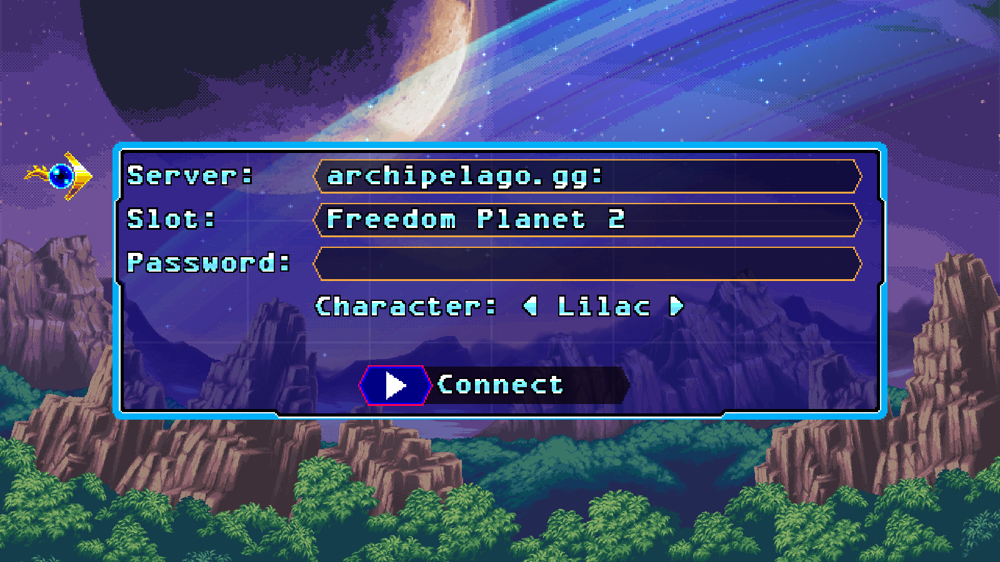
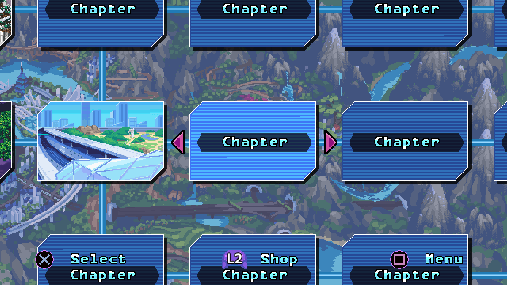
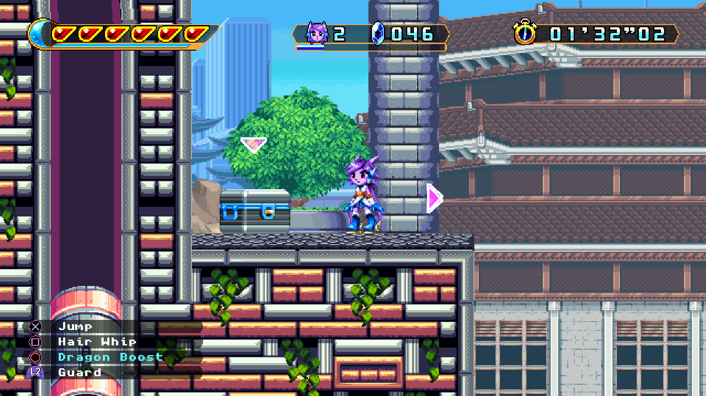
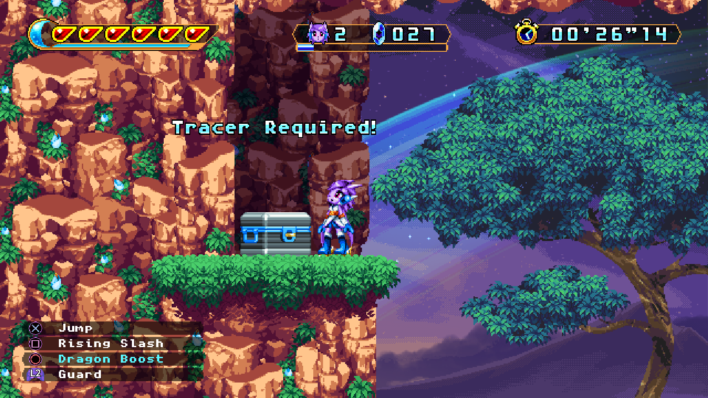
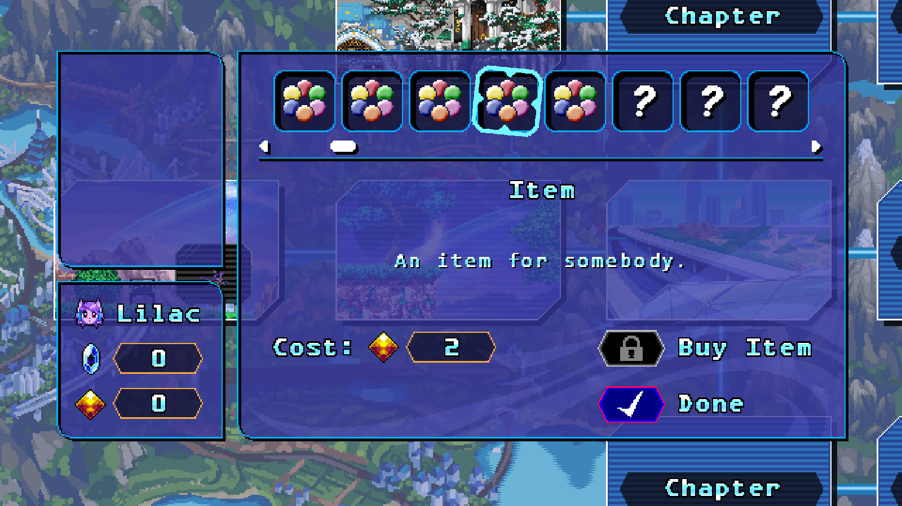
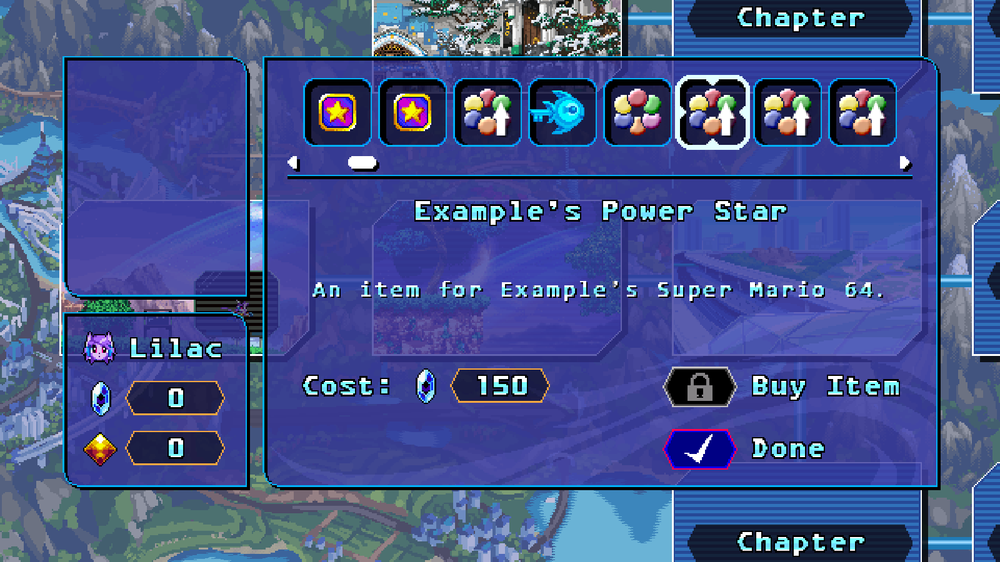
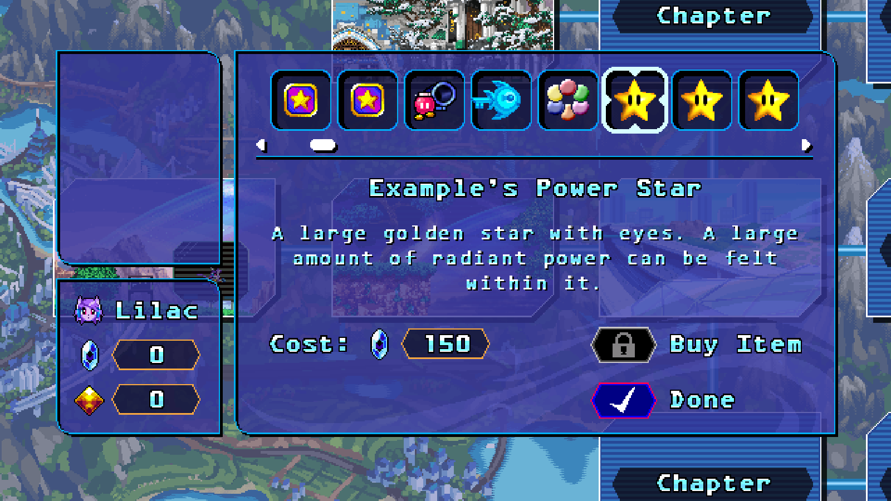

# Freedom Planet 2 Archipelago

An implementation of Freedom Planet 2 into [Archipelago](https://archipelago.gg/), currently using the [Manual](https://github.com/ManualForArchipelago/Manual) system due to an inability to understand and write a proper, standalone APWorld.

## Building

First off, ensure that your system has [Visual Studio 2022](https://visualstudio.microsoft.com/) installed alongside the `.NET Framework 3.5 development tools`, as well as [Unity 5.6.3](https://unity.com/releases/editor/whats-new/5.6.3#installs) and a copy of Freedom Planet 2 itself that is set up for modding with BepInEx and FP2Lib (using the [Freedom Manager tool](https://gamebanana.com/tools/10870) can set the game and libraries up automatically for you).

Open the solution file in VS2022 then go to `Tools > Options` and select `Package Sources` under the `NuGet Package Manager` category. Then add a package source called `BepInEx` with the source url set to `https://nuget.bepinex.dev/v3/index.json`.

Next, go to the `Assemblies` category in the `Dependencies` for the project, then delete the `Assembly-CSharp`, `FP2Lib` and `Rewired_Core` references. Right click on the Assemblies category and click `Add Assembly Reference...`, then click `Browse...` and navigate to Freedom Planet 2's install directory. Open the `FP2_Data` directory, then the `Managed` directory and select the `Assembly-CSharp.dll` and `Rewired_Core.dll` files, then click Add. Choose `Browse...` again and navigate to the install location of FP2Lib's DLL (likely within the `BepInEx\plugins\lib` directory) and select it. Click Add, then click OK to close the Reference Manager.

You should now be able to right click the solution and choose `Rebuild` to build the mod.

## Installing

Navigate to Freedom Planet 2's plugins directory (likely found at `BepInEx\plugins`) and create a directory called Archipleago. Then copy the `Archipelago.MultiClient.Net`, `Freedom_Planet_2_Archipelago` and `Newtonsoft.Json` DLLs from the build (`bin\Debug\net35` or `bin\Release\net35`) into this directory. Then grab the `clang32` version of [c-wspp-websocket-sharp](https://github.com/black-sliver/c-wspp-websocket-sharp/releases/latest) and extract the `c-wspp` and `websocket-sharp` DLLs to this directory as well.

Next, return to the root directory for Freedom Planet 2 and open the `mod_overrides` directory (create it if it doesn't exist.) Within that directory, create another directroy called `Archipelago` and copy the `archipelago.assets` file from the repository to it.

It is also recommended to enable the BepInEx console. To do this, go to the `BepInEx\config` and open `BepInEx.cfg` in a text editor. There, find the `Enabled = false` line under `[Logging.Console]` and change it to `Enabled = true`.

## Connecting


*The connection menu, with the plugin defaults displayed.*

Upon running the game and pressing start on the title screen, the game should load into a custom connection menu, with options for the server address, slotname and password, as well as the option to select your player character. Modded characters such as my own [Sonic mod](https://github.com/Knuxfan24/Freedom-Planet-2-Sonic-Mod) and Kubboros' [Spade mod](https://github.com/Kuborros/PlayableSpade) are also selectable here, but it is not guaranteed that they can fully complete a run. In addition, the character can be set to `Random Each Stage`, which will select a character at random every time the world map is loaded; modded characters are also included in this selection.

To connect, simply press enter on an option to be able to type into it. Input your server address, slotname and password (leave the field blank if the server doesn't have a password set on it) then press A on the Connect button. The game will hang for a short while until the connection is complete, at which point it will automatically go to the world map. If the connection fails, then the failure reason(s) will be printed to the BepInEx console.

Upon a successful connection, the game will save the settings into the mod's config file (found at `BepInEx\config\K24_FP2_Archipelago.cfg`). These settings will be autofilled whenever the connection menu is accessed.

## Archipelago Goal

For this implementation, the aim of the game is to unlock and complete Weapon's Core, which is locked behind a requirement of 32 Star Cards, 13 Time Capsules and access to the Bakunawa Stages. Present in the item pool are 48 Star Cards, 21 Time Capsules, unlocks for each chapter (affected by the options detailed below), extra slots for both Brave Stones and Potions (toggable in the options detailed below), tracers used for locating each stage's chests (affected by the options detailed below), each individual Brave Stone (some of which are treated as traps and have an option relating to them detailed below), each individual Potion and a few optional traps.

These traps are:

- Mirror Trap: Enables the effect of the unused Mirror Lens item by flipping the whole stage horizontally (controls are also flipped accordingly) for 30 seconds (receiving a Mirror Trap while one is active will add another 30 seconds to the duration).

- Swap Trap: Swaps the player character to one of the other original four (modded characters are excluded from the swap pool, as they can be unpredictable in their implementation).

- Pie Trap: Spawns one of Acrabelle's pies at the player's position, causing them to get stuck in it for a bit.

- Spring Trap: Spawns a spring in front of the player character, pointing in the opposite direction to the one they are facing in.

- PowerPoint Trap: Drops the game's framerate down to 15 frames per seconds for 30 seconds (receiving a PowerPoint Trap while one is active will add another 30 seconds to the duration).

## Archipelago Options

The Template YAML generated by the Archipelago Launcher (under the name `Manual_FreedomPlanet2_Knuxfan24.yaml`) has a few configurable options, these options are:

### Chapters


*The world map tile for Avian Museum, without the approriate Chapter Unlock received.*

This option determines how stage sets (grouped together in roughly the same style as in Adventure Mode) are unlocked. If set to `individual` then the world generation will have eight individual chapter items (those being `Mystery of the Frozen North`, `Sky Pirate Panic`, `Enter the Battlesphere`, `Globe Opera`, `Justice in the Sky Paradise`, `Robot Wars! Snake VS Tarsier`, `Echoes of the Dragon War` and `Bakunawa`). In contrast, setting it to `progressive` will add eight copies of a `Progressive Chapter` item, that unlocks the chapters on the world map in a linear order.

### Chests

This option makes opening the various chests scattered around the stages into location checks (which adds 82 locations into the multiworld).

### Chest Tracers


*The Chest Tracer option in Shenlin Park.*

This option is designed to make the chest searching easier, by placing arrows around the player which point in the direction of the unchecked chest locations in the active stage. These arrows can be toggled on and off with the F9 key or the Select button (which is also mapped to pause by default, so unmapping it is recommended).

### Chest Tracer Items

This option determines how items enabling the Chest Tracers will (or won't) be added to the item pool. If `disabled`, no items will be added, and every stage's Chest Tracer arrows will be immediately avaliable. If set to `perstage` then each stage's chest tracer arrows will not show up until an item is received by the name of `Chest Tracer - [Stage Name]`. The `glboal` option instead bundles all of these items into one generic `Chest Tracer` item.

If a chest tracer item is enabled, then a stage will not logically expect its chests to be checked without the approriate tracer.

### Strict Chest Tracers


*A chest in Dragon Valley without its corresponding tracer item.*

This option is an extension of the Chest Tracer Items, and thus requires one of the two to be enabled to have any effect. If this option is enabled, then a stage's chests will be entirely locked if its corresponding tracer has yet to be obtained. 

### Shops

Two seperate options, under the name of `milla_shop` and `vinyl_shop`. These two options will add location checks to their corresponding shop on the World Map (30 for Milla's, 60 for the Vinyl's). Either of these options can be enabled or disabled with no conflict to the other.

### Item Information


*Milla's shop with the shop_information option set to nothing.*

An option under the name of `shop_information` that controls how much information is given regarding an item's appearance in either of the shops, the Battlesphere's challenge list and the end of stage Star Card (this includes Freedom Planet 2's own items, which all (barring a few traps) have sprites and descriptions by default). If set to `full`, then the item's full information will be shown, including its custom sprite is one is definied (see below). In addition the shops will show the item's custom description if definied, or will show whether the item is a Trap or Progression item if not.

If set to `flags`, then the item's name and description will be hidden, but the shop description and general item appearance will still reveal whether the item is a Trap or Progression item if not.

If set to `hidden`, then the item's sprite will always show the generic Archipelago logo and the name will be hidden, giving no indication as to whether the item is useful or not. Though the receiver's name and game will still be shown in the shop menu.

If set to `nothing`, then the same visual blocks apply as the `hidden` option, except the shop will just show `An item for somebody.` in the description.

### Shop Prices

Two seperate options, under the names of `milla_shop_price` and `vinyl_shop_price`. These options control each shop's prices (with Milla's shop using Gold Gems and the Vinyl shop using Crystal Shards). Shorter games will likely want to use lower values (such as the defaults of 1 and 300 respectively), whereas longer games with more time for grinding may want to use higher values.

### Enemy Sanity

Two seperate options, under the names of `enemies` and `bosses`. These options add extra locations for each enemy (adding 72 extra locations) and boss (adding 44 extra locations) type respectively. Killing an enemy type for the first time (even if the player isn't responsible for its death) will send its location out.

### Extra Item Slots

Although unused normally, the game can support expanding the player's Brave Stone and Potion equip capacity. The `extra_items` option adds four extra items, two each of `Extra Item Slot` and `Extra Potion Slot`, which allows the player to take advantage of this feature.

### Trap Brave Stones

An option that modifies how Brave Stones with negative effects are handled upon receive. With this option off the stone will simply be added to the player's inventory for future equipping if they so desrie. With it on, then the stone is automatically equipped (assuming it was received in a stage). This can lead to more unpredictable circumstances, such as the One-Hit KO or Life Oscillation Brave Stones being activated in the middle of a boss fight, adding more danger to the items.

### Dangerous Time Limit

An option that changes how the Time Limit Brave Stone behaves. In the vanilla game, running out of time simply reduces the end of stage Crystal Shard payout. With this option on, running out of time will instead kill the player on the spot, adding more risk to the Time Limit Brave Stone, especially if the Trap Brave Stones option is on, as receiving one mid stage could lead to an unexpected death.

### Fast Weapon's Core

An option that skips the actual stage of Weapon's Core and puts the player straight into the Bakunawa Fusion boss arena.

### DeathLink
The usual Archipelago generic options are also present and work as in most implementations, although the DeathLink option has an extra choice in the form of `enable_survive`. If DeathLink is just set to enabled, then a DeathLink receive will cause the player to explode, sending them back to the last checkpoint. If Enable Survive is chosen, then the player will instead be knocked down, giving them the option to revive on the spot (although this comes with the usual base game risk of a low health pool).

### RingLink
An option common to Sonic games, enabling RingLink will synchronise any Crystal Shards collected in a stage with the values of any other RingLink players. Any received Rings will be added to the Crystal Shard count in a stage (or applied to the save directly on the map), as will any Ring losses (which will also deal a point of damage to the player or their shield). Buying an item from the Vinyl shop will also deduct the cost from the RingLink set.

> **Note:**
> RingLink tends to cause minor hitches upon collecting Crystal Shards depending on the latency to the server.

## Item Sprites and Descriptions


*The Vinyl shop menu, with no definition file present.*

By default, items for other games in the Multiworld will have a generic Archipelago icon to represent them. This can be changed by creating item definition files for various games. To do this, create a `Sprites` directory within the `mod_overrides\Archipelago` directory, then create a directory with the target game's name. For this example, we'll use Super Mario 64, so we'd create a directory called `Super Mario 64`.

Within our new directory, copy PNG files to serve as the sprites for the items in the game and then create a file called `items.json`. For each item, we want to add a definition. Let's add a definition for Super Mario 64's Power Stars, and another for the Cannon Unlocks found throughout the game (make sure the JSON begins with a `[` character and ends with a `]` character. An editor such as Visual Studio Code will highlight syntax errors).

```json
  {
    "ItemNames": [
      "Power Star"
    ],
    "Description": "A large golden star with eyes. A large amount of radiant power can be felt within it.",
    "SpriteName": "Power Star"
  }
```

```json
  {
    "ItemNames": [
      "Cannon Unlock BoB",
      "Cannon Unlock CCM",
      "Cannon Unlock JRB",
      "Cannon Unlock RR",
      "Cannon Unlock SL",
      "Cannon Unlock SSL",
      "Cannon Unlock THI",
      "Cannon Unlock TTM",
      "Cannon Unlock WDW",
      "Cannon Unlock WF"
    ],
    "Description": null,
    "SpriteName": "Cannon Unlock"
  },
  {
    "ItemNames": [
      "Metal Cap"
    ],
    "Description": "A hat made of solid steel, protecting the wearer from all but the strongest forms of damage.",
    "SpriteName": "Metal Cap"
  }
```

The `ItemNames` key is an array of strings, which tells the game what items this entry is for. In the Cannon Unlock example, we've added the various different cannon unlock item names to this list, which will make each of them use this same entry.

The `Descriptions` key should contain a short message to display in the shop menu. If this is not present (or left null as in the Cannon Unlock example) then the shop will simply read `An item for [x]'s [y].".

Finally, the `SpriteName` key should contain the name of the PNG file for this item definition (minus the file extension). This is the sprite that will be used to replace the Archipelago logo for this item. If this is not present, left null or the file doesn't exist then the sprite will fall back on its usual Archipelago logo version.


*The Vinyl shop menu, with a properly set up definition file present.*